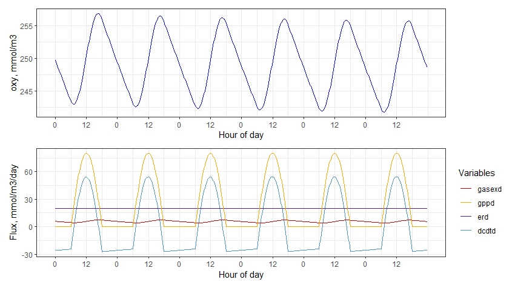

# fwoxy.R

#### Jill M. Arriola and Maria Herrmann

##### Email: <jva5648@psu.edu>

## Description

This R package, **fwoxy**, is a simple forward oxygen mass balance model that predicts the oxygen concentration of a well-mixed water column given the initial conditions and forcings. The primary use of this model is as a lab component for a marine biogeochemistry course to further understanding of biogeochemical and physical processes that influence ecosystem metabolism.

The development version of this package can be installed from Github:

``` r
install.packages('devtools')
library(devtools)
devtools::install_github('jmarriola/fwoxy')
```

After installation of the fwoxy.R package, install packages **ggplot2**, **grid**, **gridExtra**, **lattice**, and **tidyr** to ensure smooth running of the package:

``` r
install.packages('ggplot2')
install.packages('grid')
install.packages('gridExtra')
install.packages('lattice')
install.packages('tidyr')
```

### Functions

There are six functions included in this package:
1. fun\_density.R - Calculates the density of seawater.
2. fun\_eqb\_oxygen.R - Determines the oxygen equilibrium between the water column and air.
3. fun\_gas\_transfer\_velocity.R - Estimates the gas transfer velocity across the air-sea interface.
4. fun\_par\_sin\_model.R - Creates the PAR signal using a sin wave model.
5. fun\_schmidt\_oxygen.R - Determines the Schmidt number, a unitless number used in calculating gas transfer velocity.
6. fwoxy.R - The main function which sources the prior listed functions and runs the forward oxygen model.

**Note:** Functions 1 - 5 are sourced by the fwoxy.R function and do not need to be called separately. These functions should not be modified on their own.

## Running fwoxy

Before identifying parameters for the model, load associated libraries needed for fwoxy.R to run:

``` r
library(fwoxy)
library(ggplot2)
library(grid)
library(gridExtra)
library(lattice)
library(tidyr)
```

### Inputs: Parameters and forcings of the model

First, set the initial concentration of oxygen in the water column (**oxy\_ic**). Next, set the parameters of the light efficiency (**a\_param**) and ecosystem respiration (**er\_param**). Equilibrium values for **oxy\_ic**, **a\_param**, and **er\_param** are 250 (mmol/m<sup>3</sup>), 0.2 ((mmol/m<sup>3</sup>)/day)/(W/m<sup>2</sup>)), and 20 (mmol/m<sup>3</sup>/day), respectively.

``` r
# Set model parameters
oxy_ic <- 250           # (mmol/m^3), initial oxygen concentration
a_param <- 0.2          # ((mmol/m^3)/day)/(W/m^2), light efficiency
er_param <- 20          # (mmol/m^3/day), ecosystem respiration
```

Finally, set the forcings of the model. Currently, the model only accepts a constant value for each of the forcings. The forcings are depth of the well-mixed water column (**ht\_const**), salinity (**salt\_const**), water temperature (**temp\_const**), and windspeed at 10 m height (**wspd\_const**). Equilibrium values for **ht\_const**, **salt\_const**, **temp\_const**, and **wspd\_const** are 3 (m), 25 (ppt), 25 (deg C), and 3 (m/s), respectively.

``` r
# Constant Forcings
ht_const <- 3           # m, height of the water column
salt_const <- 25        # ppt, salinity
temp_const <- 25        # deg C, water temperature
wspd_const <- 3         # m/s, wind speed at 10 m
```

Although atmospheric pressure is used to calculate seawater density, in this forward model the atmospheric pressure is not defined by the user and is pre-set to 0 in the functions.

Recommendations for the ranges of the input parameters and forcings and their equilibrium values (listed below) are based on the minimum and 95th percentile values from data collected at the Cat Point Apalachicola Bay, Florida, NERR station from the year 2012.

|    Input    | Min | Max | Equilibrium |
|:-----------:|:---:|:---:|:-----------:|
|   oxy\_ic   | 100 | 300 |     250     |
|   a\_param  | 0.1 | 1.0 |     0.2     |
|  er\_param  |  0  |  80 |      20     |
|  ht\_const  | 0.5 | 5.0 |     3.0     |
| salt\_const |  5  |  35 |      25     |
| temp\_const |  15 |  30 |      25     |
| wspd\_const |  0  |  6  |      3      |

### Running the forward model

Once the inputs of the parameters and the forcings are set, you can now run the model. Before running the model select a unique name so that you can easily identify the results of this specific run. This object will store the results of the model outputs (here, example is used as the object). To include the argument values set for the constant parameters and forcings, you must call them in the function as shown here:

``` r
example <- fwoxy(oxy_ic = oxy_ic, a_param = a_param, er_param = er_param, 
                 ht_in = ht_const, salt_in = salt_const, temp_in = temp_const,
                 wspd_in = wspd_const)
```

## Outputs

The forward model will output a data frame to the R environment that can be saved as a .csv file in the working directory using the following code:

``` r
write.csv(example, "example.csv")
```

In addition to the data frame, the fwoxy function will create two plots in the Plots view in RStudio (see examples below). The top figure is the forward oxygen concentration time series versus time. This plot illustrates how the dissolved oxygen concentration (mmol/m<sup>3</sup>) in the water column will change due to the parameters and forcings of the model. The bottom figure is a plot of daily fluxes (mmol/m<sup>3</sup>/day) of the time rate of change of oxygen (dcdtd), the ecosystem respiration (erd), the gas exchange (gasexd), and the gross primary productivity (gppd) versus time. Neither of these plots will be automatically output to the working drive and will need to be saved by the user.


