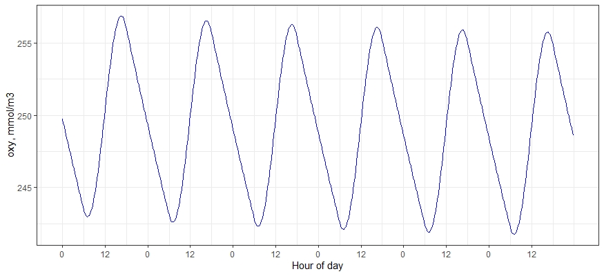

fwoxy.R
=======

#### Jill M. Arriola and Maria Herrmann

##### Email: <jva5648@psu.edu>

Description
-----------

This R package, **fwoxy**, is a simple forward model of an idealized estuarine dissolved oxygen time series and the resulting net ecosystem metabolism, i.e. gross primary productivity, ecosystem respiration, and air-sea gas exchange. The forward model is based on the Odum (1956) open water method, which determines net ecosystem metabolism of an estuary using a measured dissolved oxygen time series of a well-mixed water column. The primary use of this model is as a lab component for a marine biogeochemistry course to further understanding of biogeochemical and physical processes that influence the health of an estuary.

The development version of this package can be installed from Github:

``` r
install.packages('devtools')
library(devtools)
install_github('jmarriola/fwoxy')
```

After installation of the fwoxy.R package, install packages **ggplot2** and **tidyr** to ensure smooth running of the package:

``` r
install.packages('ggplot2')
install.packages('tidyr')
```

### Functions

There are six functions included in this package:
1. fun\_density.R - Calculates the density of seawater.
2. fun\_eqb\_oxygen.R - Determines the oxygen equilibrium between the water column and air.
3. fun\_gas\_transfer\_velocity.R - Estimates the gas transfer velocity across the air-sea interface.
4. fun\_par\_sin\_model.R - Creates the PAR signal using a sin wave model.
5. fun\_schmidt\_oxygen.R - Determines the Schmidt number, a unitless number used in calculating gas transfer velocity.
6. fwoxy.R - The main function which sources the prior listed functions and runs the forward oxygen model.

**Note:** Functions 1 - 5 are sourced by the fwoxy.R function and do not need to be called separately. These functions should not be modified on their own.

Running fwoxy
-------------

Before identifying parameters for the model, load associated libraries needed for fwoxy.R to run:

``` r
library(ggplot2)
library(tidyr)
```

### Inputs: Parameters and forcings of the model

Choose and set the name of the model run as **run\_name** so that the output .csv file will be recognizable (e.g. 'run01' or 'fwoxy\_01'). The .csv extension is added later in the function.

``` r
# Model run name
run_name <- 'example'
```

Next, set the parameters of the light efficiency (**a\_param**) and ecosystem respiration (**er\_param**). Default settings for **a\_param** and **er\_param** are 0.2 ((mmol/m<sup>3</sup>)/day)/(W/m<sup>2</sup>)) and 20 (mmol/m<sup>3</sup>/day), respectively.

``` r
# Set model parameters
a_param <- 0.2          # ((mmol/m^3)/day)/(W/m^2), light efficiency
er_param <- 20          # (mmol/m^3/day), ecosystem respiration
```

Finally, set the forcings of the model. The forcings are depth of the well-mixed water column (**ht\_const**), salinity (**salt\_const**), water temperature (**temp\_const**), and windspeed at 10 m height (**wspd\_const**). Default settings for **ht\_const**, **salt\_const**, **temp\_const**, and **wspd\_const** are 3 (m), 25 (ppt), 25 (deg C), and 3 (m/s), respectively.

``` r
# Forcings
ht_const <- 3           # m, height of the water column
wspd_const <- 3         # m/s, wind speed at 10 m
temp_cons <- 25         # deg C, water temperature
salt_const <- 25        # ppt, salinity
```

Although atmospheric pressure is used to calculate seawater density, in this forward model the atmospheric pressure is not defined by the user and is pre-set to 0 in the functions.

Recommendations for the ranges of the input parameters and forcings and their default values (listed below) are based on the minimum and 95th percentile values from data collected at the Cat Point Apalachicola Bay, Florida, NERR station from the year 2012.

|    Input    | Min | Max | Default |
|:-----------:|:---:|:---:|:-------:|
|   a\_param  | 0.1 | 1.0 |   0.2   |
|  er\_param  |  0  |  80 |    20   |
|  ht\_const  | 0.5 | 5.0 |   3.0   |
| salt\_const |  5  |  35 |    25   |
| temp\_const |  15 |  30 |    25   |
| wspd\_const |  0  |  6  |    3    |

### Running the forward model

Once the inputs of **run\_name**, parameters, and the forcings are set, you can now run the model.

``` r
example <- fwoxy(run_name = run_name, a_param = a_param, er_param = er_param,
        ht_const = ht_const, salt_const = salt_const, temp_const = temp_const,
        wspd_const = wspd_const)
```

Outputs
-------

The forward model will output a .csv file to the working drive with the **run\_name** input you set as the file name. In addition to the .csv file, the function will create two plots (see below). The first is the forward oxygen concentration time series versus time. This plot illustrates how the dissolved oxygen concentration (mmol/m<sup>3</sup>) in the water column will change due to the parameters and forcings of the model.



The second plot is of daily fluxes (mmol/m<sup>3</sup>/day) of the time rate of change of oxygen (dcdtd), the ecosystem respiration (erd), the gas exchange (gasexd), and the gross primary productivity (gppd) versus time. Neither of these plots will be automatically output to the working drive and will need to be saved by the user.


